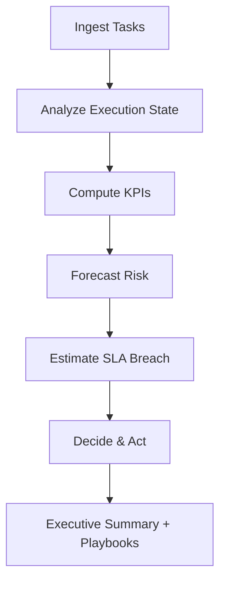

# 🧠 AI Operations Manager (Client Gold)

> **An AI-assisted operations control system that predicts delivery risk, forecasts SLA breaches, and briefs leadership with executable decisions.**

This project is **LangGraph-first** and intentionally minimal in code, yet large in operational responsibility.  
It is designed as a **decision-owning control plane**, not a chatbot, workflow automation, or dashboard-heavy app.

---

## 🎯 Problem This Solves

Most teams don’t fail because they lack tools.  
They fail because:
- ownership is unclear
- risks surface too late
- decisions are reactive
- leaders get noisy alerts, not clarity

This system acts like an **AI-assisted Operations Manager** that helps humans:
- see risk early
- understand time-to-impact
- choose mitigation options clearly

---

## ✨ What This System Does

- Predicts **operational risk before failures occur**
- Estimates **time-to-SLA breach**
- Detects overdue and unassigned work
- Assigns ownership autonomously when safe
- Escalates to humans when judgment is required
- Produces **executive-ready summaries**
- Remains **deterministic, auditable, and explainable**

---

## 🏗️ Architecture Overview

### High-Level Decision Flow



### Architectural Principle

All intelligence flows through an **explicit LangGraph state machine**.

There is:
- no hidden control flow
- no prompt-driven side effects
- no opaque agent behavior

This guarantees:
- determinism
- repeatability
- enterprise trust

---

## 📂 Project Structure

```
ai_ops_manager/
├── app.py                  # Single entry point
├── agents/
│   ├── orchestrator.py     # LangGraph state machine (core brain)
│   ├── states.py           # Explicit state contract
│   ├── decision.py         # Deterministic decision logic
│   ├── kpi.py              # Business KPI computation
│   ├── risk_signals.py     # Risk signal extraction
│   ├── risk_forecast.py    # Predictive risk scoring
│   ├── sla.py              # SLA time-to-breach estimation
│   ├── executive.py        # Executive summary generation
│   ├── playbooks.py        # Escalation strategies
│   └── learning.py         # Confidence adjustment loop
├── tools/
│   ├── jira.py             # Task ingestion (mock / API-ready)
│   └── slack.py            # Human communication layer
├── memory/
│   └── store.py            # Event memory & audit log
└── README.md
```

---

## ⚙️ Tech Stack

- **LangGraph** — core orchestration & state machine  
- **Python** — implementation language  
- **uv** — dependency & environment management  

> LangChain is used lightly for compatibility and extension.  
> This is a **LangGraph-centric system**, not a LangChain agent demo.

---

## ▶️ How to Run

### 1️⃣ Create Virtual Environment
```bash
uv venv
```

### 2️⃣ Install Dependencies
```bash
uv sync
```

### 3️⃣ Run the System
```bash
python app.py
```

### Output
- Console-based Slack-style executive summary  
- Final audit-ready system state printed to stdout  

---

## 🧠 Core Concepts

### 1️⃣ Decision Ownership
The system explicitly decides:
- **when to act autonomously**
- **when to escalate**
- **when to do nothing**

Humans always retain final authority.

---

### 2️⃣ Human-in-the-Loop by Design
AI accelerates reasoning, but:
- decisions are explainable
- actions are bounded
- overrides are always possible

This avoids blind automation.

---

### 3️⃣ Deterministic State Transitions
Every behavior is driven by:
- explicit state
- explicit transitions
- explicit policies

No randomness. No hidden behavior.

---

### 4️⃣ Small Code, Large Surface Area
The system is intentionally compact:
- easy to audit
- easy to extend
- easy to reason about

This mirrors real **MAANG / FAANG internal control systems**.

---

## 🔑 Key Design Choices

### ✅ LangGraph over Traditional Agents
- Explicit state machine
- Predictable execution
- Enterprise-grade reliability

---

### ✅ Policies over Prompts
- Prompts do not own logic
- Decisions are rule- and signal-driven
- Behavior is stable and testable

---

### ✅ Control Plane, Not an App
This system is:
- ❌ not a chatbot
- ❌ not a dashboard
- ❌ not a workflow tool  
- ✅ a **decision-making control plane**

---

### ✅ Executive Output as a First-Class Feature
Every run produces:
- a concise executive summary
- quantified risk
- time-to-impact
- concrete mitigation options

---

## 🧪 Testing Philosophy

Testing is **scenario-driven**, not unit-heavy:

- modify task inputs
- observe state transitions
- validate risk & SLA predictions
- confirm executive summaries
- verify deterministic behavior

No UI testing. No brittle mocks.

---

## 🧪 Example Output

```
📊 Ops Executive Summary
Risk Level: HIGH (score 0.7)
Overdue Ratio: 1.0
Unassigned Tasks: 1
SLA Breach Window (hrs): [12.0]

🛠 Recommended Actions:
- Reassign owner
- Reduce scope
- Add temporary capacity
```

This is the **definition of “working”**.

---

## 🏆 Use Cases

- AI agencies  
- SaaS startups  
- Consulting firms  
- Founder-led teams  
- Internal operations tooling  

---

## 💼 Freelancing Positioning

**AI Operations Manager — Client Gold**

> Replaces operational decision fatigue, not people.

- One-time build: **$5k–$8k**
- Monthly retainer: **$1k–$2k**

---

## 📌 Final Note

This project intentionally avoids:
- large dashboards
- unnecessary ML
- complexity theater

What matters here is **responsibility and clarity**.

> *Small systems with clear decision boundaries scale better than large systems without ownership.*
